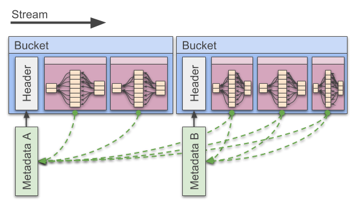
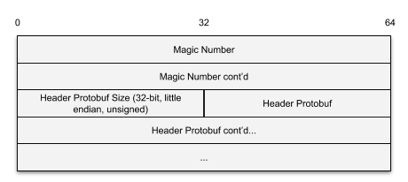
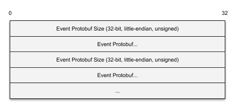
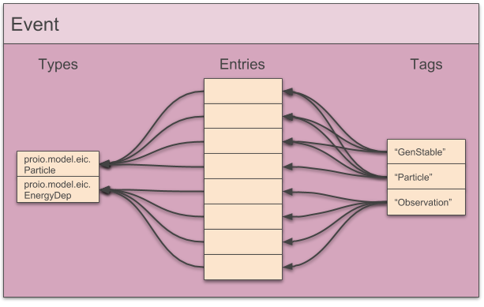

# Format
This document describes the stream format for proio.

## Buckets
Proio streams are segmented into what are called buckets.  A bucket is a
collection of consecutive events that are optionally compressed together, and
each bucket has a header.  Buckets are intended to be O(MB)-sized, i.e. large
enough for efficient compression and also much larger than the header data.  On
disk, this also translates to bucket headers occupying a very small fraction of
the total number of disk sectors used by the proio file.  This is important for
fast direct access of events, since proio streams do not contain global
locations of events.

### Header
Each bucket has a header that describes the bucket.  This header is also an
opportunity to resynchronize/recover the stream so that in principle corruption
within a bucket is isolated.  This synchronization is achieved via a magic
number.  This is a special sequence of 128 bits that identifies the start of
the bucket header.  Following the magic number is an unsigned 32-bit
little-endian integer that states the size of the remaining header which is in
Protobuf wire format and described in [proio.proto](proio.proto).

#### Metadata
Metadata entries are key-value pairs with strings as keys and byte arrays as
values.  These metadata are inserted into the stream at a certain point via a
bucket header, and are associated with all events that follow until the stream
ends.  New metadata entries with the same key as older entries will override
the older entries.

#### FileDescriptorProtos
Bucket headers can store serialized, uncompressed FileDescriptorProtos for
describing protobuf messages.  This is the means of self description for proio.
Proio streams are required to contain bucket headers with serialized
FileDescriptorProtos in the `fileDescriptor` field before the corresponding
message types appear in the stream.

### Contents
The contents of a bucket immediately follow the bucket header, and consist of
an optionally-compressed set of consecutive Event protobuf messages (described
in [proio.proto](proio.proto) and below), each preceded by an unsigned, 32-bit
value stating the number of bytes to grab for that Event message.

#### Compression
If the bucket is compressed as indicated by the header, the entire bucket is
compressed together, and must be uncompressed prior to deserializing Events
(not necessarily all at once).

For Lz4 compression, the format is that of an lz4 "frame".

Proio implementations are not required to support all compression types, but
must handle uknown compression types.

## Events
Proio Events are self-serializing containers for arbitrary protobuf messages.
In a proio stream, Events are represented by protobuf messages as described in
[proio.proto](proio.proto).

### Entries
Protobuf messages are stored in Events as entries.  Each entry has a unique
numeric id.  This id is to be assigned to new entries consecutively starting
from 1.  The `nEntries` field of Event protos store how many entries have been
added to a particular event, so that as entries are removed, uniqueness of new
ids is ensured.

Each entry is stored as a byte array in the event for lazy deserialization, and
is also accompanied by a type identifier.

### Types
Each Event stores a list of protobuf message types contained within.  Each type
gets a unique numeric identifier which can be used to look up the
fully-qualified protobuf message type string.

### Tags
Tags are the primary means of organization for Event entries.  A tag is simply
a mapping from an aribrary human-readable string to a list of unique numeric
entry identifiers.

# Other sources of information
* [Pull request for major proio rewrite](https://github.com/decibelcooper/proio/pull/14)
* [Pull request for self-descriptive cpp-proio](https://github.com/proio-org/cpp-proio/pull/3)
* [EICIO: original concept that evolved into proio](https://github.com/decibelcooper/eicio)
